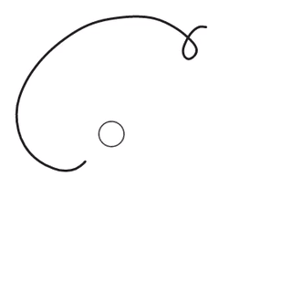

# Cirque

Utilities for negotiating between circles and paths in SVG. See [demo](http://projects.two-n.com/cirque/).



`npm install --save cirque` (or `yarn add cirque`)


## Functions

<a href="#interpolatePath" name="interpolatePath">#</a> __interpolatePath__(_a_, _b_)

Interpolates between two SVG path description strings.

Expects a _circle path_ (which gets sampled) and a polygonal _chain path_ (which gets oversampled when necessary), although two circles work just by ordinary interpolation, and two chains should work in many cases as well.

<a href="#interpolatePaths" name="interpolatePaths">#</a> __interpolatePaths__(_a_, _b_)

Individually interpolates (using [interpolatePath](#interpolatePath)) between corresponding items in two parallel arrays of SVG path strings.

<a href="#circlePath" name="circlePath">#</a> __circlePath__(_circle_)

Converts the passed _circle object_ to an SVG path string (i.e. a _circle path_ consisting of two arc commands).

<a href="#geoToCircle" name="geoToCircle">#</a> __geoToCircle__(_geometry_, [_path_], [_radius_], [_object_])

Converts the geometry object to a _circle object_ sharing its centroid.

_Circle objects_ take the form: `{ x, y, r }`

- _geometry_: any GeoJSON geometry or feature (required)
- _path_: [geographic path generator](https://github.com/d3/d3-geo#geoPath). Defaults to bare `d3.geoPath()`, which assumes pre-projected geometry
- _radius_: circle radius. Defaults to deriving radius from projected area
- _object_: mutates passed existing object rather than creating a new one

<a href="#polygonToCircle" name="polygonToCircle">#</a> __polygonToCircle__(_polygon_)

Converts a polygon to a _circle object_ sharing its centroid.

- _polygon_: an array of polygon vertices (as two-element arrays) (required)
- _radius_: circle radius. Defaults to computing radius from polygon area
- _object_: mutates passed existing object rather than creating a new one

<a href="#avoidOverlap" name="avoidOverlap">#</a> __avoidOverlap__(_objects_, [_margin_])

Pass an array of _circle objects_ to separate colliding circles so that no overlaps remain. Mutates objects in place. Margin (minimum gap, or maximum overlap if negative) defaults to 0. (Uses `d3.forceCollide`.)

<a href="#radiusScale" name="radiusScale">#</a> __radiusScale__(_area_, _value_)

Receives total area and total value as arguments, and returns a D3 scale in which the area of a circle with the given radius corresponds to a linearly-scaled value.


## Examples
```js
let render  // Given a function that renders SVG paths
let path    // Given a geo path generator
```

### Example: geometry
```js
import { geoToCircle, circlePath, interpolatePath } from 'cirque'

let geometry  // Given a GeoJSON Polygon or MultiPolygon geometry

const interpolator = interpolatePath(
  path(geometry),
  circlePath( geoToCircle(geometry, path) )
)

d3.transition().tween('shape', () => t => { render( interpolator(t) ) })
```

### Example: features

```js
import * as cirque from 'cirque'

let features  // Given an array of GeoJSON Polygon or MultiPolygon features

const scale = cirque.radiusScale( path.area(mergedFeatures), 7.5e9 )
const circles = features.map(feature =>
  circle.geoToCircle(feature, path, scale(feature.properties['population']))
)

const separatedCircles = cirque.avoidOverlap(circles)
const circlePaths = separatedCircles.map(cirque.circlePath)
const interpolator = cirque.interpolatePaths(features.map(path), circlePaths)

d3.transition().tween('shapes', () => t => { render( interpolator(t) ) })
```


## Limitations

The _chain path_ is a SVG path description of a polygonal chain (i.e. polyline, composite Bézier, etc.) containing M commands as well as absolute or relative L, C, and Z commands. Support for all path commands is planned.

The _circle path_ is a SVG path description containing an M command followed by at least one A command (but typically two). `circlePath` is a utility for generating simple, compatible _circle paths_. Some more flexiblility in the format may come in the future, including (optionally) adhering to winding order.


## Rationale

Just as a lack of color is physically considered _black_ (though artistically often considered _white_), a lack of shape can in a certain sense be called a _circle_ (or a n-sphere generally): no discrete segmentation, and no starting point any better than another.

This shapelessness is desirable for comparing values in a controlled way (say, in a bubble map) to minimize distortion and distraction.

The tools in this package amount to a method for going between precise forms such as geographic areas, and corresponding value-sized bubbles, while maintaining constancy.


## Approach

- Avoids any available [more sophisticated](http://spencermortensen.com/articles/bezier-circle/) circle approximation methods in favor of brute force sampling, and splits path commands when necessary to maintain a balance between a) mapping path commands uniformly and b) aligning per distance unit.


## Discussion and contribution

Open an [issue](https://github.com/two-n/cirque/issues/new) or [pull request](https://github.com/two-n/cirque/compare) with either high-level use cases or practical support tickets, or contact us on [Twitter](twitter.com/2nfo). We do intend for this package to stay within its stated mission, but advice, critique, and experiences are welcome.
